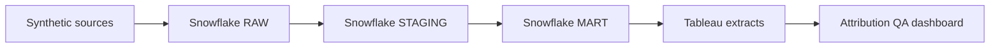

# Subscription Growth Intelligence and Attribution QA

An end-to-end analytics case study demonstrating how marketing, web-session, subscription, and billing data can be reconciled to distinguish a genuine conversion decline from a measurement failure.

> **Synthetic-data notice:** Every customer, session, campaign, subscription, and billing event in this project is generated. No proprietary company or customer data is used, and the project is not affiliated with any organization.

## Published dashboard

[View the interactive Attribution and Tracking QA dashboard on Tableau Public](https://public.tableau.com/app/profile/dennis.ho2795/viz/subscription-growth-intelligence/02AttributionQA)

## Executive summary

This dashboard investigates a sharp decline in tracked conversions for the `PS_GENERIC` campaign on mobile traffic to `/people-search` from July 8–10, 2026.

During the incident, click-ID coverage fell from **91.9% to 18.9%**, while tracked trial events declined from **15.0 to 1.0 per day**. Backend trial starts did not decline; they increased slightly from **16.9 to 17.7 per day**. Ad-platform clicks also remained healthy.

Because the deterioration was concentrated in client-side measurement while independent backend outcomes remained stable, the evidence is consistent with localized tracking or attribution loss rather than a genuine collapse in customer demand. The available evidence narrows the likely failure domain but does not prove whether the underlying cause was a tag, redirect, consent behavior, page release, or another instrumentation issue.

## Business question

**Should the marketing team reduce campaign spending after tracked conversions suddenly decline?**

The analysis reconciles independent checkpoints across the acquisition funnel:

1. Ad-platform clicks
2. Captured web sessions
3. Click-ID coverage
4. Tracked trial events
5. Backend trial starts

This prevents a client-side measurement failure from being mistaken for deteriorating campaign performance.

## Key findings

| Signal                       | Pre-incident average | July 8–10 average | Interpretation                               |
| ---------------------------- | -------------------: | ----------------: | -------------------------------------------- |
| Click-ID coverage            |                91.9% |             18.9% | Attribution identifiers were largely lost    |
| Tracked trial events per day |                 15.0 |               1.0 | Client-side conversion measurement collapsed |
| Backend trial starts per day |                 16.9 |              17.7 | Actual subscription demand remained stable   |
| Ad-platform clicks           |               Stable |            Stable | No corresponding loss of campaign traffic    |

## Dashboard guide

| View                                         | Purpose                                                                              |
| -------------------------------------------- | ------------------------------------------------------------------------------------ |
| Campaign-Level Clicks vs Captured Sessions   | Identifies divergence between ad-platform demand and captured web activity           |
| Segment Click-ID Coverage                    | Localizes the measurement failure to the affected campaign, device, and landing page |
| Tracked Trial Events vs Backend Trial Starts | Tests whether the conversion decline also appears in the subscription system         |
| July 8–10 reference bands                    | Align the incident window across all three charts                                    |

The date and campaign controls apply to all charts. The device control applies only to the segment-level charts because the source advertising data is not available at device grain.

## Recommendation

Do not pause or materially reduce the affected campaign solely because tracked conversions declined.

Instead:

* Audit click-ID capture, tagging, redirects, consent behavior, and recent releases on the mobile `/people-search` experience.
* Temporarily reconcile campaign decisions against backend trial and billing data.
* Preserve unattributed conversions rather than forcing them into a campaign.
* Backfill attribution only where a reliable click or visitor identifier can be recovered.
* Continue monitoring independent funnel checkpoints after instrumentation is repaired.

## Technical implementation

The project models four synthetic sources:

| Source         | Grain                      |    Rows |
| -------------- | -------------------------- | ------: |
| Ad performance | Campaign-day               |     848 |
| Web sessions   | Individual session         | 148,133 |
| Subscriptions  | Individual subscription    |  17,059 |
| Billing events | Individual billing attempt |  23,556 |

The analytical workflow is:

The dashboard is primarily supported by:

* `MART.MART_ATTRIBUTION_HEALTH`
* `MART.MART_ATTRIBUTION_SEGMENT`

The broader warehouse model also preserves campaign economics, subscription cohorts, unattributed conversions, and billing outcomes.

## Data validation

The Snowflake QA suite completed **14 of 14 checks successfully**, including:

* Source-key uniqueness
* Billing foreign-key integrity
* Valid advertising and billing business rules
* Paid-start and first-payment consistency
* Spend reconciliation
* Session reconciliation
* Net-revenue reconciliation
* Preservation of unattributed subscriptions
* Detection of the expected campaign and segment anomaly

See the [Snowflake QA tests](sql/snowflake/04_qa_tests.sql) for the executable validation logic.

## Current public scope

The current Tableau Public release contains the completed **Attribution and Tracking QA** dashboard.

Executive acquisition-economics and subscription-cohort Tableau views are not included in the current public release. The repository retains the supporting Snowflake campaign and cohort models to demonstrate the broader data architecture without representing those additional dashboards as completed public deliverables.

## Methodology and limitations

* All data is synthetic and intentionally includes a diagnostic scenario.
* The attribution model uses the most recent eligible non-direct campaign touch within 30 days before trial creation.
* Attribution assigns reporting credit; it does not estimate incremental causal lift.
* Backend trial starts are treated as the authoritative record of subscription creation.
* A tracking divergence can identify the likely failure domain but cannot establish a specific technical root cause without deployment, tag, consent, redirect, and server-log evidence.
* Device-level comparisons are limited to sources available at device grain.
* Findings demonstrate an analytical method, not the performance of a real company.

## Key project files

* [Architecture and modeling decisions](docs/architecture.md)
* [Data dictionary](docs/data_dictionary.md)
* [Metric definitions](docs/metric_definitions.md)
* [Anomaly investigation](docs/anomaly_investigation.md)
* [Responsible limitations](docs/limitations.md)
* [Snowflake mart models](sql/snowflake/03_mart_views.sql)
* [Snowflake QA suite](sql/snowflake/04_qa_tests.sql)
* [Build and reproduction instructions](docs/build_runbook.md)
