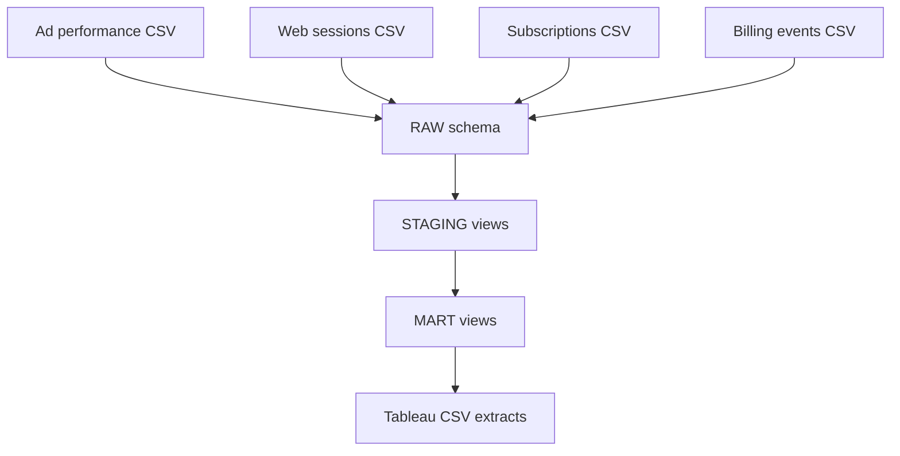

# Architecture and Modeling Decisions

## MVP flow

## Why CSV sources for the interview MVP

The case study needs multiple source grains, but it does not need a second
database to prove that point. Direct, reproducible CSV extracts keep the
pre-interview build within the available 14-18 hours and focus attention on
Snowflake modeling, attribution, billing eligibility, QA, and communication.
PostgreSQL source-loading scripts can be added after the interview.

## Layer responsibilities

| Layer | Responsibilities | Must not do |
|---|---|---|
| `RAW` | Preserve source columns, add load metadata, expose reproducible inputs | Apply business attribution or silently repair source values |
| `STAGING` | Cast types, deduplicate, normalize UTM/campaign fields, enforce one clean row per source key | Join multiple fact tables at their raw grains |
| `MART` | Apply attribution, maturity, billing aggregation, reconciliation, and reporting metrics | Hide unattributed conversions or immature denominators |
| Tableau extracts | Present stable reporting outputs and lightweight display calculations | Reimplement core business logic differently from Snowflake |

## Required marts

| Mart | Intended grain | Primary use |
|---|---|---|
| `mart_campaign_daily` | Calendar date and campaign | Executive acquisition economics and trends |
| `mart_subscription_cohort` | Trial cohort month and attributed campaign | Trial conversion, rebills, and realized value |
| `mart_attribution_health` | Calendar date and campaign | Campaign-level click/session/trial reconciliation |
| `mart_attribution_segment` | Calendar date, campaign, device, and landing page | Localize web/backend divergence without repeating campaign-level ad clicks |

## Fact-to-fact join rule

Spend, sessions, subscriptions, and billing are separate facts. Each must first
be reduced to the target reporting grain or to one row per subscription before
being joined. A successful row-count query is not enough; reconciliation tests
must prove that total spend and total net revenue remain unchanged after joins.

The subscriptions source includes backend-captured signup campaign, device, and
landing-page context for diagnostics. This source is kept separate from the
governed last-non-direct web attribution. That distinction permits campaign-
segment reconciliation when client-side sessions are missing without pretending
the two attribution methods are interchangeable.

Ad clicks are available only at campaign-day grain. They therefore appear in
`mart_attribution_health`, not in each row of `mart_attribution_segment`.
Repeating a campaign's clicks across device/page rows would inflate totals and
create invalid session-to-click rates. The dashboard uses campaign-level click
stability alongside segment-level session and backend-trial diagnostics.

## Known limitations

- Visitor identity is deterministic in the synthetic data and does not model
  real cross-device identity loss.
- The attribution model is last non-direct touch, not incrementality.
- Ad-platform clicks and captured sessions are expected to differ.
- Ninety-day net revenue is observed cohort value, not LTV.
- The anomaly demonstrates a diagnostic pattern but cannot prove the exact
  client-side failure mechanism without instrumentation logs.
